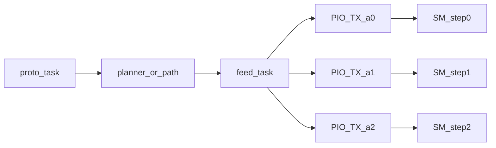

# Experimental 3rd axis (SliderMC only)

Branch `axis3` from current `main`. **No docs, no SliderCtrl/Web/Host/Doc changes.**

Default is `axis=1`. Enable extras with `CS axis 2` or `CS axis 3`. `IA` / `CG axis` report the same count.

---

## Timing / headroom verdict

Step pulses are **PIO, not CPU**. Each axis owns a state machine, joined TX FIFO (8 words), and a high-prio FreeRTOS feed task. Planner math only *fills* words; PIO drains them.

**What actually underran on 1→2 (and would get worse on 3):**

- Each axis currently **uploads its own 14-instruction PIO program** into `pio0` (`[src/motion/pio_step.cpp](src/motion/pio_step.cpp)` `load_axis_sm`). Instruction RAM is 32 words: `2×14=28` fits; `**3×14=42` does not**. A third `pio_add_program` will fail and axis 3 will silently have `sm=-1`.
- Feed CPU cost scales with axes. `planner_fill_fifo` does sine/brake math per word (`[src/motion/planner.cpp](src/motion/planner.cpp)`). FIFO time cushion is only **3 ms / 8 words** (`[PLANNER_FIFO_TIME_BUDGET_MS](include/planner_math.h)`, `[PLANNER_PACK_MIN_HZ=2500](include/planner_math.h)`). During ramps (`n=1`) three SMs drain in parallel; one slow fill pass can dry a FIFO.
- Path play is **lockstep**: fill stops if *any* TX is full (`[motion_path_fill_fifo](src/motion/motion_path.cpp)`). A 3rd FIFO makes this more likely.
- **Path idle-slice bug (existing 2-axis, worse with 3):** if one axis has 0 steps in a slice while another moves, no timed hold is queued on the idle SM. Only all-idle slices add `g_gap_cycles`. The next word on the idle axis can start early and break slice lockstep. Fix: queue a delay-only gap (or keep that SM waiting) for zero-step axes in a mixed slice.
- `[motion_diag](include/motion_diag.h)` only records **axis-0** FIFO min / a single underrun counter — 2-axis underruns on axis 1 are easy to miss.

**CPU headroom: yes for typical sliders; tight only on steep multi-axis ramps.**

- Typical: 320 step/mm × 100 mm/s = **32 kHz**. Cruise packs up to 64 pulses/word → a few hundred words/s per axis. Comfortable on one core. At 64 ksteps/s packed, 3 axes ≈ 3000 words/s.
- Worst is **not** max speed — it is the **2500 Hz packing crossover** (`PLANNER_PACK_MIN_HZ`): `n=1`, FIFO holds only ~3.2 ms. Three axes ≈ 7500 word-calculations/s of `sinf`/`sqrtf`/double math. At 125 MHz that is ~16.7k cycles/word if saturated.
- PIO pulse gen itself is fine: SM clock 50 MHz, max ≈ **259 kHz** (`50e6/193`), not the stale “≥300 kHz” comment in `pio_step.h` (that assumed 125 MHz). Configured 200 mm/s × 320 = 64 kHz/axis is well under that.
- RP2040 has **4 SMs on pio0** — SM count is OK. Bottleneck order: **instruction memory → FIFO scheduling / path sync → SRAM (path) → CPU at 2.5 kHz crossover**. Not GPIO or raw step throughput.

**PIO polarity — confirmed.** Instruction RAM only needs **one 14-word program per STEP polarity**, not per axis. Worst case axis1=`DRV_STEP_active=0` and axis2=`DRV_STEP_active_2=1` already occupies both slots (`2×14=28` of 32). Axis 3 is only ever 0 or 1, so it **reuses one of those two programs**. A third `pio_add_program` is never required.

**Chosen polarity rule:** no `drv_step_active_3`. Axis 3 STEP polarity **always follows axis 2**. Other axis-3 keys (steps, envelope, DIR/EN/ERROR/limits, home, max v/a) stay independent. Sharing is still required: today’s code uploads a *copy* per SM even when polarity matches, and that third copy is what overflows.

**Do this branch:** suggestions **2, 3, 6, 7**, plus the polarity-share (required). Skip 4 (per-axis `ID`) and 8/9. Path RAM uses the split pool below instead of growing BSS.

2. **Independent planner fill** — extend `any_tx_full` / `want2` in [`motion_task.cpp`](src/motion/motion_task.cpp). Do not abort the pass because one FIFO is full.
3. **Path fill + idle-slice sync** — shared time-slice; put per axis independently; zero-step axis in a mixed slice must consume the same slice time.
6. Feed stack **1536 → 2048**.
7. Keep `DEBUG_HW` off; gate `dbg_hw_allowed()` against new EXT / LIMIT3 overlaps.

**CPU clock — do not raise it on this branch.** It would help the *feed* soft-float path (M0+ has no FPU; more MHz ≈ more words/s). It does **not** help PIO pulse gen, and it is easy to break timing: SM clock is `sysclk / PIO_STEP_SM_CLKDIV` (125/2.5 = 50 MHz) but [`pio_step_sysclk_hz()`](src/motion/pio_step.cpp) is **hard-coded 50e6**. Raising sysclk without scaling clkdiv makes every step faster; raising sysclk and keeping 50 MHz SM (higher clkdiv) is the only safe form, and still needs `clocks_get_hz()` instead of the constant. Stay at 125 MHz; fix fill/path first. 133 MHz in-spec is a later experiment only if `ID` underruns remain.

---

## Path buffer = one word pool, split by axis count

Keep today’s SRAM budget (~128 KB = `65536` int16 samples), **not** `3 × 32768`.

- 1 axis: all `65536` samples on axis 0
- 2 axes: `32768` each
- 3 axes: `21845` each (`65536 / 3`)

`path_buffer_size` clamps the **per-axis** logical length to `min(CS, pool / n_axes)`. Changing `axis` while a path is stored: refuse if `PN` exceeds the new per-axis cap, or clear the path. `PD a [b [c]]` as before (omitted → 0).

---

## Pinout (breaking EXT move)

Apply **unconditionally** (even when `axis=1`). Existing EXT wiring on Pico GP2–5 and Zero GP27/26/15/14 **moves**.

**Pico / Pico W** — axis 1 (GP18–21, 26–27) and axis 2 (GP13–10, 7–6) unchanged:

- Axis 3: `SW_LIMIT_R3` GP0, `SW_LIMIT_L3` GP1, `DRV_ERROR3` GP2, `DRV_EN3` GP3, `DRV_DIR3` GP4, `DRV_STEP3` GP5
- EXT: GP8, GP9, GP14, GP15
- `CAMERA_CTRL` GP22 (new; unused today)

**RP2040-Zero** — axis 1/2 and UART12/13 unchanged:

- Axis 3: STEP GP27, DIR GP26, EN GP15, ERROR GP14, LIMIT_L GP18, LIMIT_R GP17
- `CAMERA_CTRL` GP25
- EXT: GP24, GP23, GP22, GP21

**CAMERA_CTRL:** reserve in `[pins.h](include/pins.h)`, init as GPIO output inactive in `[gpio.cpp](src/board/gpio.cpp)`. **No protocol command** on this branch (no docs/clients). `IX`/`VG` can list the pin when `DEBUG_HW` is off.

`PIN_AXIS3_SUPPORTED 1` on both boards. Axis-2/3 GPIOs are claimed only when `axis>=2` / `axis>=3`.

---

## Firmware shape

Keep the existing `_2` pattern; add `_3` mirrors. Experimental, so no array refactor.

**Config** (`[config_store.h](include/config_store.h)` / [`config_store.cpp`](src/config/config_store.cpp)):

- Replace `axis2_use` with **`axis`** (`1|2|3`, default `1`). `IA` is `config_get()->axis` (clamped to what the board supports).
- Helpers: `config_axis2_enabled()` → `axis>=2`, `config_axis3_enabled()` → `axis>=3`. `axis_hw_count()` returns `axis`.
- Legacy ini: accept `axis2_use` on load (`0`→`axis=1`, `1`→`axis=2` if `axis` not already set). `CS axis2_use` can stay as a write alias for one release so old tests/scripts do not break, then prefer `CS axis`.
- Axis-3 copies of steps/envelope/DIR/EN/ERROR/limits/home/max speed+accel. **No `drv_step_active_3`** — STEP polarity copies axis 2.
- Session `soft_left/right_mm_3`.
- [`axis_hw.h`](include/axis_hw.h): `axis==2` → `*_3` pins/keys.

**PIO** (`[pio_step.cpp](src/motion/pio_step.cpp)`): `AXIS_MAX 3`. At most **two** programs in `pio0` (active-low + active-high). Each SM is configured with its own STEP pin and pointed at the matching offset. Axis 3 uses axis 2’s polarity/program. Host stub arrays `[3]`. **Do not ignore SM-claim failure.** DIR stays GPIO and still only flips after FIFO drain.

**Planner / motion** (`[planner.cpp](src/motion/planner.cpp)`, `[motion_stub.cpp](src/motion/motion_stub.cpp)`):

- `AXIS_MAX 3`; `g_ax[3]`.
- Coordinated MT: keep axis 0 as time master. Store `ratio1=|d1|/|d0|` and `ratio2=|d2|/|d0|` (today `g_coord_ratio` is a single scalar). Scale each follower with **that axis’s** `max_speed`/`max_accel` (current `scale_cruise_accel` hard-codes axis-1 limits). If axis 0 is skipped (`MT _ x y`), use the first moving axis as master. Planner sync stays best-effort duration match; path mode is the true shared clock.
- `motion_move_to2` → `motion_move_to_n(...)` with 3 optional NaNs.
- Jog mask: `0=all`, `1`, `2`, `3`. Joy: third optional percent.
- Home `MH 1|2|3`. `SP` / `SL`/`SR` third token (`_` skip).
- Status: `pos_mm_3`, `vel_mm_s_3`, `target_mm_3`, `acc_mm_s2_3`.

**Path:** one sample pool split by `axis_hw_count()` (see above). `PD a [b [c]]`. Shared slice time + idle-slice hold.

**Protocol** (`[commands.cpp](src/protocol/commands.cpp)`, `[verbose.cpp](src/protocol/verbose.cpp)`, banner in `[parser.cpp](src/protocol/parser.cpp)`):

- Extend `parse_move_args` / `parse_window_args` to **3 tokens** (today a 3rd token is “trailing junk”).
- `IP` / `?` / verbose: `#I p1 | p2 | p3` (and matching `#M`/`#H` groups). Grow status buffer **192 → 256**.
- `IX`/`VG`: STEP3/DIR3/EN3/ERROR3/LIMIT*3, CAMERA_CTRL, new EXT numbers. Bump `PinIndexRow rows[40]` if the extra six axis-3 pins plus CAMERA overflow it.
- Host tests in [`test/host/test_protocol_main.cpp`](test/host/test_protocol_main.cpp): `CS axis 3` → `IA:3`, migrate `axis2_use`, coordinated 3-axis MT ratio, `SP`/`PD`/`MH 3`, skip `_`.

---

## Pico 2 / RP2350 — later, not this branch

Helpful for **headroom**, not required for experimental 3-axis on current boards.

| | RP2040 Pico / Zero | Pico 2 (RP2350) |
|---|---|---|
| Core | M0+ no FPU @ 125 MHz | M33 + SP FPU + DP coprocessor @ 150 MHz |
| SRAM | 264 KB | 520 KB |
| PIO | 2 blocks / 8 SMs / 32 instr each | 3 blocks / 12 SMs / 32 instr each |

What it would actually buy SliderMC:

- **FPU** — the real win. `planner_fill_fifo` is soft-float `sinf`/`sqrtf`/double on M0+. That is the 2.5 kHz underrun risk. Hardware float cuts fill time a lot more than a 125→150 MHz bump.
- **SRAM** — path pool would not need to shrink per extra axis.
- **PIO** — a third per-axis program copy would fit (or sit on pio2). Polarity-share remains good hygiene but is no longer a hard stop.

What it would **not** buy:

- GPIO. A **Pico 2** (40-pin) can reuse the Pico map. An **RP2350 Mini / Zero-class** board is as pin-starved as the RP2040-Zero — 3 full driver+limit sets still consume the header.
- Protocol or planner design. Independent fill and path idle-slice stay necessary.
- Drop-in for existing wired Picos. New `BOARD_PICO2` env, PlatformIO/earlephilhower RP2350, and a pin map.

**Stay on Pico / Zero for `axis3`.** Revisit Pico 2 only if 3-axis underruns remain after fill/path fixes. Prefer the full Pico 2 over a Mini if the goal is the current Pico pinout plus headroom.