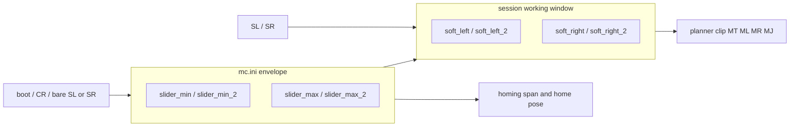

# Session working window (`SL` / `SR` / `GL` / `GR`)

## Recommendation: two layers (same pattern as `SS` vs `init_speed`)




- `**slider_min` / `slider_max` (and `_2`)** stay the **mechanical envelope**: installer rail, homing pose/span, `CG`, reboot. `none` = no envelope on that side (rotary).
- **Session window** is the B4Slider **working window**. Boot copies envelope → session. `SL`/`SR` change session only (your choice). Bare `SL` / `SR` reload that side from config, like bare `SS`.
- Today B4Slider shrinks the envelope via `CS slider_min` (`[MC_client.setSoftLimits](E:/GITHUB/SliderCtrl/MC_client.py)` → persist to `mc.ini`). That fights “nothing remembered after power-off”. `SL`/`SR` is the correct fix.

**Do not** have `SL` write `slider_min`. `CG slider_min` must keep showing the rail so JKSlider marks and installers stay honest.

## Command design (as specified, with a few rules)


| Short             | Long                  | Behaviour                                                                             |
| ----------------- | --------------------- | ------------------------------------------------------------------------------------- |
| `SL` / `SetLeft`  | `SL [<pos> [<pos2>]]` | Session **min** (ML / − side). Bare = reset to `slider_min` / `_2`.                   |
| `SR` / `SetRight` | `SR [<pos> [<pos2>]]` | Session **max** (MR / + side). Bare = reset to `slider_max` / `_2`.                   |
| `GL` / `GetLeft`  | `GL`                  | `GL:<pos>` or `GL:<pos> <pos2>` when axis2 on. Disabled: `GL:-` (same token as `IT`). |
| `GR` / `GetRight` | `GR`                  | Same shape as `GL`.                                                                   |


Parse like `MT`: skip `_` / `none` / `N` / `*` on one axis, **leave the other axis unchanged**. Unlike `MJ`, a missing 2nd arg is **not** “set axis2 to 0”.

```text
SL 120          # axis1 left only
SL _ 45         # axis2 left only
SL              # reset left on all active axes to config
GL              # GL:120   or   GL:120 45   or   GL:-
```

Silent on success. No `SE` required. Legal in joy-mode (does not exit `MJ`). Rejected while path-mode is active (`!E:busy`), same as `SS`. Not in the EMO allowlist.

Help rows (S + G groups), cheatsheet GROUPS in [tools/render_command_cheatsheet.py](E:/GITHUB/SliderDoc/tools/render_command_cheatsheet.py).

## Planner: mostly already correct

`[remaining_steps_for_sign](E:/GITHUB/SliderMC/src/motion/planner.cpp)` already zeros remaining travel **further past** a rail, and leaves the opposite sign free:

```778:795:src/motion/planner.cpp
  if (!AX.st.homing) {
    if (sign > 0) {
      int64_t to_lim = soft_max_steps(axis) - AX.pos_steps;
      if (to_lim < 0) {
        to_lim = 0;
      }
      ...
```

So after `SL`/`SR` puts the pose **outside** the window: jog/`MJ`/`MT` **into** the window works; further **out** sits (soft stop), no `!E` spam — same as joy-at-rail.

**Change:** `soft_min_steps` / `soft_max_steps` (and dest clamp in `motion_move_to2` / stub) must read **session** window, not `McConfig`. Homing keep using **config** `axis_hw_slider_min/max` for seek cap and `home_finish` pose.

Path playback stays unbounded (host-authored), unchanged.

Live: next FIFO fill sees the new rails (same as live `SS`).

## Validation suggestions

- **Machine min/max, not operator L/R.** UIC L/R swap maps buttons to `SL` vs `SR`. B4 already sorts `soft_l > soft_r` before apply (`[B4Slider.py](E:/GITHUB/SliderCtrl/B4Slider.py)` `apply_soft_limits`).
- If both session sides are enabled and **left > right** → `!E:limit` (do not auto-swap on the MC; keep `GL` matching last `SL`).
- Session window **cannot exceed the envelope** when that envelope side is set (`SL` past `slider_max` → `!E:limit`). If envelope is `none`, any session wall is allowed.
- `CS slider_min/max`: update envelope only; **clamp** session inward if it would now sit outside the envelope; do not otherwise reset a narrowed window.
- No `SL none` in v1 (bare `SL` already “open that side to the rail”). Add later if a host needs to disable a session wall while config still has a rail.

`motion_set_soft_limits` today writes **config** (`[planner.cpp](E:/GITHUB/SliderMC/src/motion/planner.cpp)`). Retarget it to session (both axes), or replace with `motion_set_window_min/max`.

## MC_Client (required)

Repo: [SliderCtrl `MC_client.py](E:/GITHUB/SliderCtrl/MC_client.py)`.

Keep `self.slider_min` / `slider_max` (and `_2`) as the **CG envelope** after `fetchConfig`. Do **not** overwrite them in `setSoftLimits`.

Session window cache: existing `_soft_min` / `_soft_max` (used for LED / `isAtSoftLimit` / `isNearSoftLimit`). After boot, copy envelope → cache (same as MC). Refresh cache from `GL`/`GR` after sets if needed.


| Method                                | Wire                                                                                                                                             |
| ------------------------------------- | ------------------------------------------------------------------------------------------------------------------------------------------------ |
| `setLeft(pos=None, pos2=None)`        | `SL` / `SL <pos>` / `SL _ <pos2>` (skip like `moveTo`)                                                                                           |
| `setRight(pos=None, pos2=None)`       | `SR` same                                                                                                                                        |
| `getLeft()` / `getRight()`            | parse `GL:` / `GR:` (`-` → `None`)                                                                                                               |
| `setSoftLimits(min_limit, max_limit)` | **Breaking:** no longer `CS slider_min`. Sends `SL`+`SR`. `None` on a side = **bare `SL`/`SR`** (open that side to the envelope), not `CS none`. |


`MC_MKS_Client.setSoftLimits` stays local (no SliderMC `SL`); leave as-is.

JKSlider does **not** call `setSoftLimits` today (marks vs window). Leave it on the envelope from CG; LED warn still uses full rail.

`[SimpleExample.py](E:/GITHUB/SliderCtrl/SimpleExample.py)` / `[JoystickExample.py](E:/GITHUB/SliderCtrl/JoystickExample.py)` keep calling `setSoftLimits` — they become a session window automatically.

## B4Slider (required)

`[B4Slider.py](E:/GITHUB/SliderCtrl/B4Slider.py)` must treat the MC session window as source of truth (the working window *is* MC `SL`/`SR`).

- `apply_soft_limits()`: keep sorting `soft_l`/`soft_r` if crossed, then `mc.setSoftLimits` / `setLeft`+`setRight` + `ui.set_soft_limits` for the LED. **Never `CS`.**
- SET+MOVE_L/R **tap**: still `soft_* = getPosition()` then apply → `SL`/`SR` at current pose.
- SET+MOVE **hold** (open one side): send **bare** `SL` or `SR` (reset to envelope), then set local `soft_l`/`soft_r` from `mc.slider_min`/`slider_max`.
- Power-up / four-button reset: same as today (window = envelope) but via session commands; reboot already restores MC session from `slider_min/max`.
- MOVE_L/R cruise **targets** stay the cached window ends (A/B). MC clips if the cache is stale; cache is updated on every SET.
- Do not persist the shot. User-manual already says nothing is remembered after power-off — this makes that true.

## Docs (required)

### New chapter (same shape as motion-path / motion-joy)

Add `[mc/working-window.md](E:/GITHUB/SliderDoc/mc/working-window.md)` with SliderCtrl.css / `--doc-title` / `--doc-path`, linked from `[mc/README.md](E:/GITHUB/SliderDoc/mc/README.md)`.

Outline:

- What it is: session working window vs persisted envelope; B4 A/B *is* this window; JKSlider marks are not.
- Why not `CS slider_min`: that overwrote the rail and survived reboot.
- Commands table: `SL`/`SR`/`GL`/`GR` plus bare reset; skip tokens like `MT`.
- Speed/clip law: all moves including `MJ` bound to the window; pose outside can only move inward; silent sit further out.
- Typical flow (B4-style), e.g.

```text
...
GL              # GL:0     (boot = slider_min)
GR              # GR:600
...
SL 120          # SET+MOVE_L tap at 120 mm
SR 480          # SET+MOVE_R tap at 480 mm
ML              # cruise to left wall (120)
...
SL              # SET+MOVE_L hold — open left to slider_min
...
```

- 2-axis skip example; envelope `!E:limit`; homing/path ignore session window.
- UIC: `MC_Client.setLeft` / `setSoftLimits`; B4 owns the operator chords.
- Config keys `slider_min`/`max` still the envelope; firmware files (`session`, `planner` clip).

### Command lists / cheat sheets

Same sweep as `MJ`: `[contract/protocol.md](E:/GITHUB/SliderDoc/contract/protocol.md)` S+G tables; drop “UIC may shrink `slider_min`”; `[tools/render_command_cheatsheet.py](E:/GITHUB/SliderDoc/tools/render_command_cheatsheet.py)` + regenerate HTML/MD/PDF; `[architecture/marks-vs-working-window.md](E:/GITHUB/SliderDoc/architecture/marks-vs-working-window.md)` (B4 writes `SL`/`SR`, not CS); `mc/config.md` / `motion.md`; `[uic/api/overview.md](E:/GITHUB/SliderDoc/uic/api/overview.md)` `setSoftLimits` / new getters; B4 `[user-manual.md](E:/GITHUB/SliderDoc/uic/projects/b4slider/user-manual.md)` one sentence that the window lives on the MC until reboot. No protocol version bump.

## Tests

Host tests in `[test/host/test_protocol_main.cpp](E:/GITHUB/SliderMC/test/host/test_protocol_main.cpp)`: parse/skip/bare reset; `GL`/`GR` vs `CG slider_min`; persist-not-on-SL; clamp/`!E:limit`; 1-axis pose outside window can `MR`/`MJ +` but not `ML`; 2-axis skip; path-busy; CS envelope clamp.