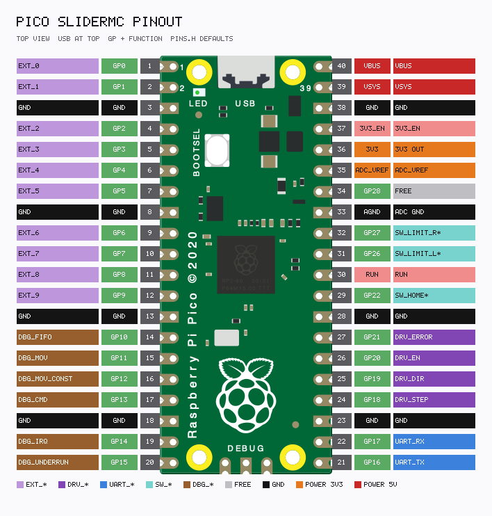
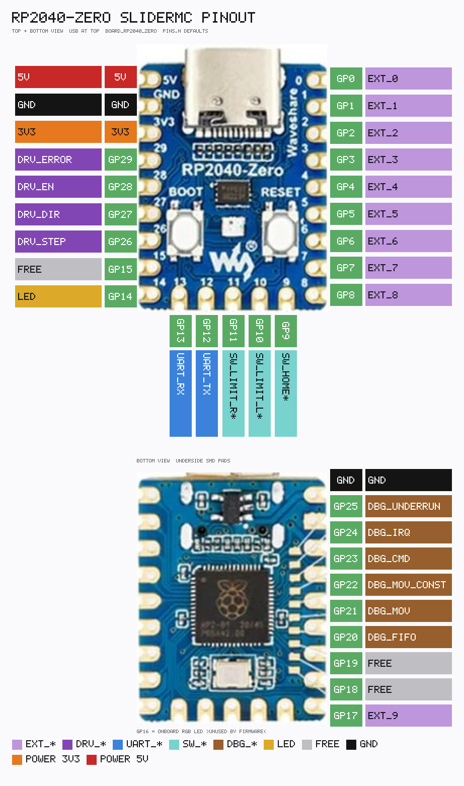

# Pin map

Pins are fixed in `include/pins.h` at compile time and cannot be changed by protocol commands.
Select a board with PlatformIO envs `pico` (default), `picow`, or `rp2040zero` (see [BUILD.md](BUILD.md)).

Live dumps on the device:

- `P` / `Pins` — machine-readable `PIN_*=GPIO` lines
- `IX` / `Pinout` — ASCII table of GP number, name, and brief description (≤80 columns)

---

## Raspberry Pi Pico (`BOARD_PICO`, env `pico`)

Regenerate: `python docs/render_pico_pinout.py` → [`pico_pinout_mc.txt`](pico_pinout_mc.txt) + PNG.

| Symbol | GPIO | Role |
|--------|------|------|
| `PIN_EXT_0` … `PIN_EXT_9` | 0…9 | General-purpose outputs (`Xn` / `Extn`; inactive at boot) |
| `PIN_DBG_FIFO` | 10 | Oscilloscope: TX FIFO non-empty (`DEBUG_HW` only) |
| `PIN_DBG_MOV` | 11 | Oscilloscope: moving or homing (`DEBUG_HW` only) |
| `PIN_DBG_MOV_CONST` | 12 | Oscilloscope: consecutive FIFO delays equal (`DEBUG_HW` only) |
| `PIN_DBG_CMD` | 13 | Oscilloscope: command handler busy (`DEBUG_HW` only) |
| `PIN_DBG_IRQ` | 14 | Oscilloscope: pulse on PIO TX-not-full IRQ (`DEBUG_HW` only) |
| `PIN_DBG_UNDERRUN` | 15 | Oscilloscope: pulse on FIFO underrun while moving (`DEBUG_HW` only) |
| `PIN_UART_TX` | 16 | UART TX to UI controller |
| `PIN_UART_RX` | 17 | UART RX from UI controller |
| `PIN_DRV_STEP` | 18 | STEP to driver |
| `PIN_DRV_DIR` | 19 | DIR |
| `PIN_DRV_EN` | 20 | Enable |
| `PIN_DRV_ERROR` | 21 | Driver fault / E-stop (always polled; halt + command gate while active) |
| `PIN_SW_HOME` | 22 | Homing / reference switch (handled only if `SW_HOME_use=1`) |
| `PIN_LED` | `LED_BUILTIN` (GP25) | Status / heartbeat LED (onboard) |
| `PIN_SW_LIMIT_L` | 26 | Hard limit left (handled only if `SW_LIMIT_L_use=1`) |
| `PIN_SW_LIMIT_R` | 27 | Hard limit right (handled only if `SW_LIMIT_R_use=1`) |

GP28 is free on classic Pico.

UART baud rate: **1 000 000**.

GP16/GP17 are **UART0** pins on the RP2040. The Arduino core exposes UART0 as `Serial1`, selected via `PIN_UART_SERIAL` in `pins.h`.

Available HW UART pin pairs:

- UART0 = `Serial1` — TX/RX: 0/1, 12/13, 16/17
- UART1 = `Serial2` — TX/RX: 4/5, 8/9, 20/21, 24/25

If you change the pair, keep `PIN_UART_SERIAL` in sync with the UART block.

---

## Raspberry Pi Pico W (`BOARD_PICO_W`, env `picow`)

Same header pin map as classic Pico, except the status LED:

| Symbol | GPIO | Role |
|--------|------|------|
| *(all other pins)* | *(same as Pico)* | Same as table above |
| `PIN_LED` | **28** | External status / heartbeat LED |

The Pico W onboard LED is on the CYW43 WiFi chip (`LED_BUILTIN` → WL_GPIO0), **not** GP25. The earlephilhower core does **not** support CYW43 access from FreeRTOS tasks; SliderMC heartbeat runs on the `proto` task. Use env `picow` and wire an external LED to **GP28**. Do not drive `LED_BUILTIN` with this firmware under FreeRTOS.

---

## Waveshare RP2040-Zero (`BOARD_RP2040_ZERO`, env `rp2040zero`)

Regenerate: `python docs/render_rp2040zero_pinout.py` → [`rp2040zero_pinout_mc.txt`](rp2040zero_pinout_mc.txt) + PNG.

| Symbol | GPIO | Role |
|--------|------|------|
| `PIN_EXT_0` … `PIN_EXT_8` | 0…8 | Extender outputs |
| `PIN_EXT_9` | 17 | Extender output 9 (bottom SMD pad) |
| `PIN_SW_HOME` | 9 | Homing / reference switch |
| `PIN_SW_LIMIT_L` | 10 | Hard limit left |
| `PIN_SW_LIMIT_R` | 11 | Hard limit right |
| `PIN_UART_TX` | 12 | UART TX to UIC (UART0 / `Serial1`) |
| `PIN_UART_RX` | 13 | UART RX from UIC |
| `PIN_LED` | 14 | External status / heartbeat LED |
| `PIN_DBG_FIFO` … `PIN_DBG_UNDERRUN` | 20…25 | Oscilloscope outputs (`DEBUG_HW` only) |
| `PIN_DRV_STEP` | 26 | STEP to driver |
| `PIN_DRV_DIR` | 27 | DIR |
| `PIN_DRV_EN` | 28 | Enable |
| `PIN_DRV_ERROR` | 29 | Driver fault / E-stop |

GP15, GP18, GP19 are free. **GP16** is the onboard WS2812 RGB data pin and is **unused** by firmware (do not treat it as `PIN_LED`).

---

## Shared notes

GPIO numbers are fixed in `pins.h` (not changeable via protocol).  
Active levels for all pins except UART are config keys (`DRV_STEP_active`, `SW_HOME_active`, …): `0` = low-active, `1` = high-active.  
Hard-limit **usage** is gated by `SW_LIMIT_L_use` / `SW_LIMIT_R_use` (default off).  
Home-switch **usage** is gated by `SW_HOME_use` (homing input only, no halt).  
`PIN_DRV_ERROR` is always polled (`DRV_ERROR_active`); assert → emergency halt + command gate. See [CONFIG.md](CONFIG.md) / [MOTION.md](MOTION.md).

`PIN_EXT_0`…`9` are always outputs. Polarity via `EXT_n_active`; boot level is **inactive**. Logical on/off: `X0`…`X9` / `Ext0`…`Ext9`.

STEP polarity (`DRV_STEP_active`) selects one of two PIO programs. See [MOTION.md](MOTION.md).

## Hardware debug pins (`DEBUG_HW`)

Oscilloscope outputs when `#define DEBUG_HW` is present in `pins.h` (currently `1`). They are fixed **active-high**, not configurable via `CS`, and disappear from firmware and the `P` / `IX` dump when `DEBUG_HW` is undefined.

| Pin | Meaning |
|-----|---------|
| `DBG_FIFO` | 1 after a word is put into the PIO TX FIFO; 0 when the FIFO is empty |
| `DBG_MOV` | 1 while moving or homing |
| `DBG_MOV_CONST` | 1 when consecutive FIFO word delays match (cruise); 0 during accel/decel |
| `DBG_CMD` | 1 around each protocol command segment (not realtime `?` / `!`) |
| `DBG_IRQ` | brief pulse in the PIO TX-not-full IRQ handler |
| `DBG_UNDERRUN` | brief pulse when TX stalls empty while moving |

GPIO numbers depend on the board variant (tables above).
